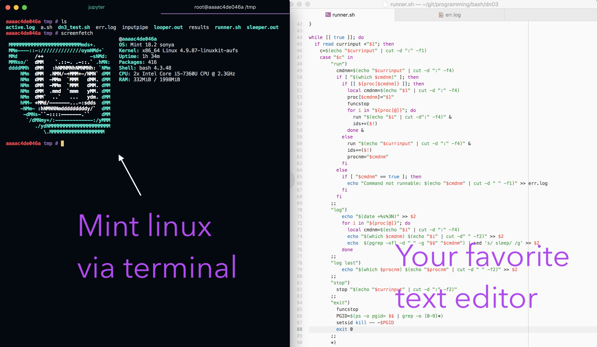

# OS-1-VSS

Another way of using virtual env via docker

# Intro / Philosophy

The idea of using docker and not using [virtualbox](https://www.virtualbox.org/) or [parallels](https://www.parallels.com/products/desktop/) is very simple.
First, **cross platform** (Mac, Linux, Win). Second, **low-weight**.
Third, **super fast** coz you don't need gui or interface for studying `bash`.

# [Docker](https://docs.docker.com/install)

First you need to install `docker` on your machine.

Then you have to run docker daemon.

Let's start.

# Commands

Pull docker container with `Mint`

`docker pull vcatechnology/linux-mint`

Then run that command to start docker:

`docker run -it vcatechnology/linux-mint`

You launched your first docker container - in other words you launched linux.

If you would like to work with files using your lovely IDE or code editor do next steps:

`docker run -it -v /Users/USERNAME/DIRECTORY:/tmp vcatechnology/linux-mint`

`/Users/USERNAME/DIRECTORY ` - Which folder to mount from your machine

`:/tmp` - To docker file system

`vcatechnology/linux-mint` - Name of the docker container

Stop it:

`ctrl + D`

Finally how it looks like:

# Notes

For the whole course I was missing just one command:

`passwd` or smth like that. When you start your docker container you can easily
update + upgrade Linus distro and install missing command via apt.   

`apt update && apt upgrade`

`apt install whois`
